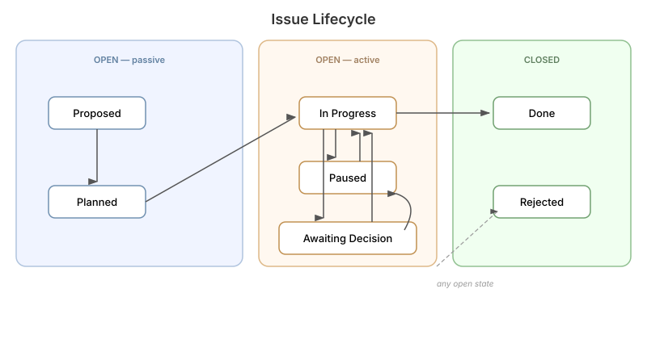

# Issue Lifecycle

## Key transitions

- **Proposed → Planned**: prioritised, or added to a milestone.
- **In Progress → Awaiting Decision**: Claude adds a comment explaining the options.
- Adding an issue to a milestone bumps Proposed → Planned.

## Invariants

Enforced by `script/check-project-integrity.sh`:

- Every open issue has a Status.
- No milestoned issue is Proposed.
- Every active issue has a milestone.
- In a closed milestone, all issues are Done or Rejected.

## Milestone closure

Active issues are removed from the milestone and drop back to Planned. Only Done and Rejected issues remain.

## Other statuses

**Meeting**: non-issue items on the project board. Not part of the lifecycle; excluded from integrity checks.
